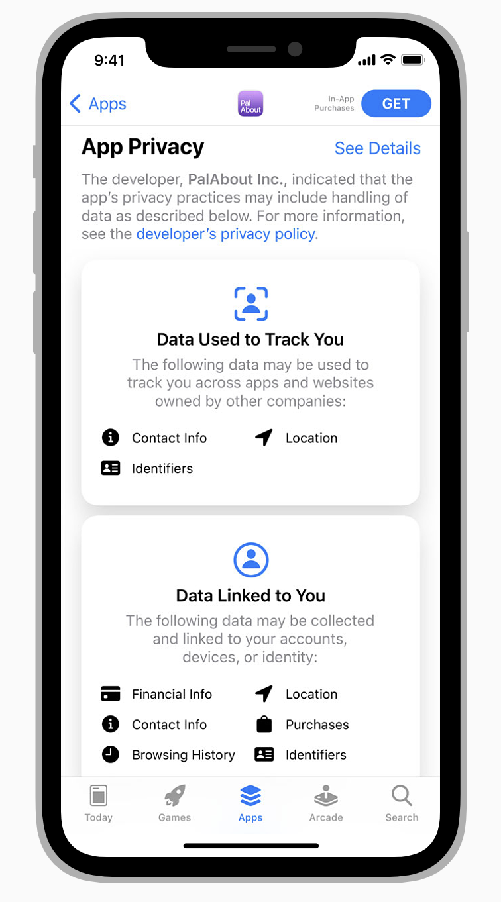

# Accessing User Data & Resources

사용자 프라이버시는 매우 중요하다. 앱의 신뢰성을 위해서는 어떤 사생활 자료와 자원들을 요청했는지, 이들을 어떻게 사용했는지에 대해 투명하게 공개 되어야 한다. 다음에 접근하기 위해서는 권한을 요청해야한다.

- 개인적인 자료 : 위치, 건강, 재정, contact, 기타 다른 개인적인 정보
- 사용자 생성 자료 : 이메일, 메시지, 캘린더, contacts, 게임 플레이 정보, Apple Music, HomeKit, 영상, 음악, 사진 등
- 보호되어야 하는 자원 : Bluetooth 연결, 자동화 집 특성, 와이파이 연결, 로컬 네트워크 등
- 카메라와 마이크 같은 장치

> *중요*
iOS/iPadOS 14.5부터 기기의 광고 id에 접근하기 위해서는 AppTrackingTransparency 를 꼭 요청해야한다.
> 

앱이 업데이트 되거나 새로 만드는 경우, 수집하는 사생활 관련 글과 자료에 대해 제공해야한다. 그래서 앱 스토어의 앱 제품 페이지에서 이에 대해 소개할 수 있다.(앱 스토어에서 언제든 관리 가능하다.) 이용자들은 앱 다운로드 전 privacy 상세를 확인하고 다운로드 한다.  [App privacy details on the App Store](https://developer.apple.com/app-store/app-privacy-details/) 참조

## 접근 권한 요청

사용자 데이터나 보호된 자원에 접근하기 전에, 권한을 요청해야한다. 시스템에서 접근 권한을 요청하기 위한 표준 alert를 제공한다. 개발자는 이 권한이 필요한 이유를 설명하여 이 alert에 표기하면 된다. 이용자들은 이 alert로 확인하거나 Settings > Privacy 에서 확인할 수 있다.

### 액세스가 필요한 시점에 요청

개인정보 요청 혹은 장치 정보에 접근 시, 특히 필요 없어 보이는 경우 사람들이 의심을 가지는 건 당연하다. 이상적으로는 접근이 필요한 기능을 이용자가 실제로 사용하기 전까지 권한 요청을 기다려야한다. 위치 요청의 경우, 현재 위치 버튼은 사람들이 위치를 공유했다는 사실을 기억하도록 한다. [Using the Location Button](https://developer.apple.com/design/human-interface-guidelines/ios/app-architecture/accessing-user-data/#using-the-location-button) 참조

### 기능에 필요한 경우 앱 시작시에 요청

사용자들은 왜 앱이 정보가 필요한지 명백한 경우 시동 시간에 요청하는 것을 덜 귀찮아 한다. 앱 시작과 동시에 트래킹 하기 원한다면, 정보 수집 전에 시스템 alert를 띄워야된다. [Clarifying Tracking Requests](https://developer.apple.com/design/human-interface-guidelines/ios/app-architecture/accessing-user-data/#clarifying-tracking-requests) 참조

### 어떻게, 어떤 것을 요청하는 지 표기하자

표준 alert는 앱 이름과 허가/불가 버튼 사이에 당신의 문구를 표기한다. 직관적이고 구체적이며 이해하기 쉽도록 작성해라. sentence-style [capitalization](https://help.apple.com/applestyleguide/#/apsgb744e4a3?sub=apdca93e113f1d64)을 사용하고 수동적인 단어를 피하며 마침표를 포함해야 한다.

|  | 예시 | 비고 |
| --- | --- | --- |
| Good | 이 앱은 코골이를 탐지하기 위해 밤 동안 녹음합니다. | 데이터를 어떻게, 그리고 왜 수집하는지를 명백히 보여주는 능동적인 문장. |
| Bad | 더 나은 사용을 위해 마이크 접근이 필요합니다. | 정확한 이유가 없고 두루뭉술한 수동적인 문장. |
| Bad | 마이크 권한을 사용합니다. | 어떠한 이유도 없는 강압적인 문장 |

## 커스텀 화면은 권한 요청 전에.

앱 문맥으로 사람들이 왜 권한을 요청하는지 이미 알고 있는 것이 이상적이다. 추가적인 상세를 제공해야 한다면, 시스템 alert가 뜨기 전에 커스텀 화면을 표기하면 된다. 다음의 가이드라인은 카메라, 마이크, 위치, contact, 달력, 트래킹 등 보호되는 자원에 접근하기 위한 권한을 요청하는 시스템 alert 전에 커스텀 화면을 적용한 것들이다.

### 버튼은 하나.

사람들은 커스텀 화면에 alert를 띄우는 버튼 외에 다른 버튼이 있으면 조종된다는 느낌을 받을 수 있다. 선택을 방해하기 때문. 다른 종류의 조종은 버튼에 ‘허용'과 같은 단어를 사용하는 것이다. 버튼이 의미적으로 그리고 비주얼적으로 alert의 버튼과 비슷해 보이면, 사람들은 의미 없이 alert의 허용 버튼을 누르게 된다. ‘계속' 혹은 ‘다음'과 같은 단어를 사용해서 시스템 alert를 여는 행동이라고 명확히 해야한다.

### 다른 액션은 금물.

예를 들면, 닫기 버튼. alert를 띄우지 않기 위한 닫기 혹은 취소 버튼은 제공하지 않도록 한다.

*alert에서 금지하면 되니까*

## 트래킹 요청은 명확하게.

앱 트래킹은 민감한 이슈이다. 경우에 따라 추적의 이점을 명확하게 설명할 수 있는 커스텀 화면을 출력하는 게 좋다.

**절대 사람들에게 혼동을 줄 수 있는 커스텀 화면을 시스템 alert 앞에 출력하지 마라.** 사람들은 읽지 않고 빨리 탭해서 alert를 끄고는 한다. 이런 경향을 이용해서 선택에 영향을 주는 커스텀 화면은 앱 스토어 리뷰어에 의해 거절될 수 있다. [Displaying a Custom Screen Before a Permission Alert](https://developer.apple.com/design/human-interface-guidelines/ios/app-architecture/accessing-user-data/#displaying-a-custom-screen-before-a-permission-alert) 참조

거부될 만 한 금지 커스텀 화면들이 있다. 인센티브를 제공하거나, 요청처럼 보여지거나, 경고 이미지를 내부에 표기하거나, alert 밑에 화면을 깔아서 유도하거나. [App Store Review Guidelines: 5.1.1 (iv)](https://developer.apple.com/app-store/review/guidelines/#data-collection-and-storage) 참고

## 위치 버튼

iOS 15 이후, Core Location은 버튼을 제공해서 사람들이 앱에 임시 허가를 부여하여 필요할 때에 위치를 접근할 수 있도록 허가한다. 위치 버튼의 외형은 앱에 맞게 다양할 수 있지만, 즉시 알아볼 수 있는 방식으로 위치를 공유 작업을 전달한다.

위치 버튼은 장치 위치에 접근할 수 있는 임시 허가를 승인한다. 만약 앱에 아무런 허가가 없다면, 위치 버튼 탭은 표준 alert에서 ‘이번만 허용'을 누른 것과 같은 효과를 낸다. 이전에 ‘앱 사용 하는 동안 허용'을 눌렀다면 상태 변화는 없다. [LocationButton](https://developer.apple.com/documentation/corelocationui/locationbutton) (SwiftUI), [CLLocationButton](https://developer.apple.com/documentation/corelocationui/cllocationbutton) (Swift) 참조

앱을 처음 열고 위치 버튼을 누르면, 시스템은 표준 alert를 띄운다. 이 alert는 어떻게 위치 데이터에 접근을 제한하는지 설명하고, 공유 시 표기할 위치 인디케이터를 보여준다.

버튼 액션의 이해도를 확인 후, 이용자는 위치 접근 일회용 허가를 부여하기 위해서 단순히 위치 버튼을 누르기만 하면 된다. 일회용 허가는 앱을 멈추면 사라지지만, 버튼 동작의 이해도를 재확인할 필요는 없다.

### 위치 공유의 가장 가벼운 방법. 위치 버튼.

메시지, 포스트, 가게 찾기, 건물 판별, 공장 혹은 동물 위치 추적처럼 장소 값을 붙여야 한다고 가정하자. 만약 당신이 사용자가 ‘이번만 허용'을 주로 선택하는 것을 안다면, alert를 띄우기 보단 위치 버튼을 사용해서 위치 정보를 공유 받는 것이 좋다.

### UI 커스터마이징

- ‘Current Location’ 혹은 ‘Share My Current Location’과 같은 시스템 제공 문구 사용.
- filled와 outLined 중 택 일
- 배경색과 문구 색 선택
- radius 조정

사용자가 위치 버튼을 인식하고 신뢰를 주기 위해서, 이 외의 UI 속성은 커스터마이징 불가하다. 또한 시스템은 낮은 대비 색상 조합이거나 너무 투명한 문제들에 대해 당신에게 경고하면서 위치 버튼이 올바르도록 한다. 이러한 문제 수정 외에, 개발자는 문구가 버튼에 적합한지 책임을 가진다. 예를 들어 버튼 문구는 사이즈, 번역 후 문자 수 등의 문제로 잘리지 않고 딱 맞아야한다. 

> *주의
위치 버튼 커스터마이징에 지속적으로 문제가 생긴다면, 사용자가 위치 버튼을 눌러도 데이터에 접근할 수 없을 수도 있다. 버튼이 앱 특화된 다른 액션으로 동작할 수는 있지만, 버튼이 일반적인 기대와 다르게 행동한다면 사람들은 앱 신뢰도를 잃을 것이다.*
> 

## 마이크 킷. ShazamKit

ShazamKit은 ShazamKit 카탈로그 혹은 사용자 커스텀 카탈로그와 오디오 샘플을 매칭시켜 오디오 인식를 가능케 한다. iOS 15 이후 ShazamKit으로 다음을 할 수 있다.

- 최근 실행 음악 장르에 부합하는 그래픽으로 앱 사용 경험 강화
- 오디오와 동기화된 선택 자막(CC) 혹은 수화 제공으로 청각 장애인들의 미디어 컨텐츠 접근
- 온라인 강의, 홈쇼핑 같은 문맥의 가상 컨텐츠로 인앱 경험 동기화

앱 인식을 위한 오디오 샘플을 얻기 위해 기기의 마이크가 필요하면, 접근을 요청해야 한다. 모든 종류의 권한 요청처럼, 왜 요청하는지 사람들의 이해를 돕는 것이 중요하다. 권한을 받은 후, 다음의 가이드라인을 지켜라

### 녹음은 짧게.

사용자가 앱이 인식을 위해 녹음하도록 허락했지만, 항상 켜져 있기를 기대하지는 않는다. 사생활 보호를 위해서 필요한만큼의 샘플을 얻는 정도만 사용하자.

### 선택지(iCloud에 앱의 인식된 노래 저장) 제공.

인식된 오디오를 iCloud에 저장할 수 있다면, 첫 번째 선택지로 제공해라. 음악 인식 컨트롤과 Shazam 앱 모두가  인식된 오디오의 소스로 당신의 앱을 보여주더라도, 이용자들은 라이브러리에 저장해서 컨트롤할 수 있는 앱을 더 좋아한다. 

[ShazamKit](https://developer.apple.com/documentation/shazamkit) 참고

---

## Reference

원본

[Accessing User Data - App Architecture - iOS - Human Interface Guidelines - Apple Developer](https://developer.apple.com/design/human-interface-guidelines/ios/app-architecture/accessing-user-data/)
