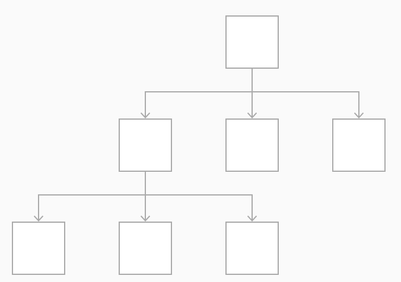
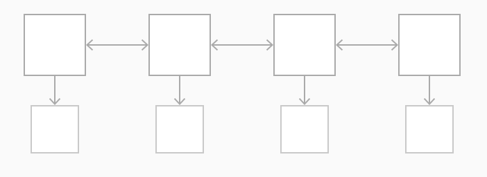
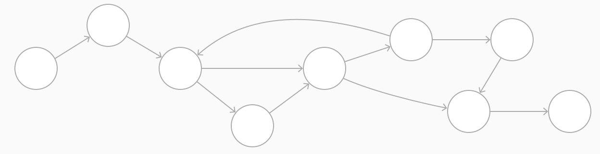

# Navigation

사람들은 자신의 기대에 만족하지 않기 전까진, 네비게이션을 눈치채지 못한다. 주의를 환기시키지 않고 앱의 구조와 목적을 지원하도록 네비게이션을 구현해야한다. 네비게이션은 자연스럽고 친숙하며, 인터페이스를 지배하거나 컨텐츠로의 집중을 깨지 않아야한다. iOS에는 세 가지 스타일의 네비게이션이 있다.

## Hierarchical

목적지 도달까지, 한번에 한 화면을 이동한다. 다른 목적지를 위해서는, 이전 과정들을 다시 밟거나 처음부터 시작하여 다른 길로 가야한다.

설정(Settings), 메일(Mail) 앱이 이 네비게이션 스타일이다.

## Flat

컨텐츠 카테고리간 전환 방법. Music, App Store가 이 방식이다.

## ****Content-Driven or Experience-Driven****

내용에 따라 자유롭게 움직이거나, 내용이 navigation을 정한다. 게임, 책, 다른 immersive 앱들이 이 스타일을 채택한다.

일부 앱들은 여러 네비게이션 스타일을 조합하여 사용한다. 예를 들어, flat 스타일의 한 앱은 각 카테고리는 hierarchcal 스타일로 구현하기도 했다.

## 분명한 Path

사용자는 자기가 앱의 어디에 있는지, 그리고 목적지에 어떻게 가야하는지 알아야한다. 네비게이션 스타일에 상관 없이, 내용을 통한 path가 논리적이고 예측 가능하며 따라하기 쉬워야한다. 일반적으로 각 화면마다 하나의 path를 줘라. 한 화면에서 여러 문맥을 보여줄 필요가 있다면, action sheet / alert / popover / modal view 등을 이용하라.

## 내용을 빠르고 쉽게 얻을 수 있는 정보

최소한의 탭, 스와이프, 화면만 필요하도록 정보 구조를 구성해라.

## 터치 제스처로 유동성 생성

최소한의 인터페이스 조작으로 쉽게 움직이게 해라. 예를 들어, 화면의 양 옆 사이드에서 스와이프로 이전 화면을 돌아갈 수 있도록 할 수도 있다.

## 기본 네비게이션 컴포넌트를 써라

가능한 한, 기본 컴포넌트를 써라. 페이지 컨트롤, 탭바, 부분 컨트롤, 테이블 뷰, 콜렉션 뷰, 그리고 split 뷰. 사용자는 이런 것들에 이미 친숙하기에 직관적으로 너의 앱을 어떻게 쓸지 알 것이다.

## 계층 데이터 횡단

네비게이션바의 제목은 계층에서의 현재 위치를 알려주고, back 버튼은 이전 위치로 돌아가기 쉽게 한다. [Navigation Bars](https://developer.apple.com/design/human-interface-guidelines/ios/bars/navigation-bars/) 참조

## iPad에서는, Tab bar 보단 Split View

Split View는 탭 바처럼 빠른 네비게이션을 제공하면서, 넓은 화면에서 이용이 용이하다. [Split View](https://developer.apple.com/design/human-interface-guidelines/ios/views/split-views/)  참조

## Page Control

page control은 몇 페이지가 사용 가능한지, 그리고 현재 활성 페이지를 명확히 알려준다. 날씨 앱이 page Control을 사용하여 지역별 날씨를 보여준다. [Page Control](https://developer.apple.com/design/human-interface-guidelines/ios/controls/page-controls/) 참조

### 팁

Segmented Control과 toolbar는 네비게이션이 불가능하다. Segmented Control은 다른 카테고리로의 정보 조직화에 사용해라. 툴바는 현재 문맥에 맞는 상호작용을 제공하는데 사용해라. 추가적인 [Segmented Control](https://developer.apple.com/design/human-interface-guidelines/ios/controls/segmented-controls/)과 [toolbar](https://developer.apple.com/design/human-interface-guidelines/ios/bars/toolbars/) 정보 참조

---

## Reference

원본

[Navigation - App Architecture - iOS - Human Interface Guidelines - Apple Developer](https://developer.apple.com/design/human-interface-guidelines/ios/app-architecture/navigation/)
