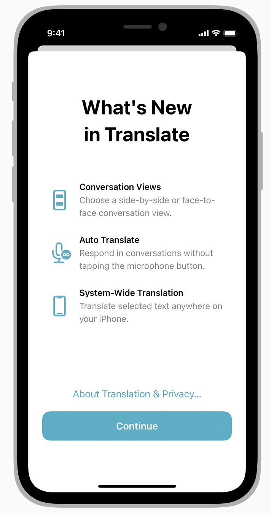

# Onboarding

Onboarding으로 새로운 유저를 환영하고 복귀자를 재연결할 수 있다. 빠르고, 재밌으며 교육적인 이 선택적인 온보딩 경험은 사람들이 방해없이 앱을 최대한 활용할 수 있도록 도와준다.

## 설정 뿐 아니라 즐길 수 있도록 도와주는 온보딩 제공

사람들이 앱의 정보를 얻을 기회에 주어짐에 감사할 수 있지만, 단지 사용만을 원할 수도 있다. 설정이나 상세 라이센스가 온보딩에 포함되지 않도록 해라.

## 빠른 액션

초기 설정과 launch 화면 후, 사람들이 즉시 앱을 사용하고, 즐길 수 있도록 해라. 튜토리얼이나 인트로가 필요하다면, 스킵할 수 있게하고 사용자가 돌아왔을때 자동으로 보이지 않게 해라.

## 도움 요청을 예측해라

사람들이 갇힐만한 때를 능동적으로 찾아라. 예를 들어 게임은 일시 정지거나 캐릭터가 초보인 경우 유용한 팁을 캐주얼하게 노출한다. 사람들이 처음에 놓친 경우 튜토리얼을 다시 리플레이 할 수 있게 해라.

## 튜토리얼의 필수사항만 살펴보기

뉴비에게 가이드를 제공하는 것은 괜찮지만, 이 튜토리얼은 훌륭한 앱 디자인을 대체할 순 없다. 가장 중요한 점은 직관적인 앱을 만드는 것이다. 사람들에게 너무 많은 가이드가 필요하다면, 앱 디자인을 재확인해라.

## 재밌고 발견 가능한 학습

백문이 불여일견. 행동이 재밌고 효과적이다. 애니메이션과 인터렉트로 점진적으로 그리고 상황에 맞게 안내하라. 대화식 스크린샷 형태를 피해라

[Onboarding - App Architecture - iOS - Human Interface Guidelines - Apple Developer](https://developer.apple.com/design/human-interface-guidelines/ios/app-architecture/onboarding/)
