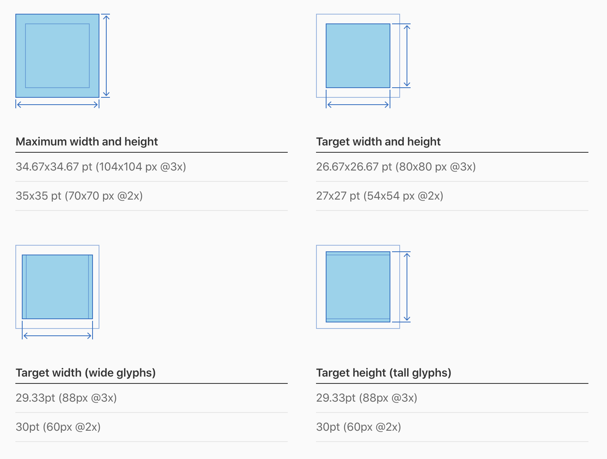

# Home Screen Quick Actions

홈 화면 퀵 액션은 유용하며 앱의 특화된 기능을 편리하게 사용할 수 있는 방법이다. 사람들은 앱 아이콘을 잠시동안 눌러서 퀵 액션을 사용할 수 있다. (3D 터치로, 사용자는 잠시 아이콘을 눌러 메뉴를 볼 수 있다.) 예를 들어, 메일의 퀵 액션은 Inbox, VIP 메일함, 검색 시작, 새 메시지 작성이 가능하다. 앱 특화 액션 뿐 아니라, 앱 삭제와 홈 화면 수정 기능도 제공한다.

각 퀵 액션은 제목을 가지고 왼쪽이나 오른쪽에(홈 화면에서의 앱의 방향에 따라 결정된다.) 글리프가 있고, 선택적으로 부제가 있다. 제목과 부제는 항상 좌정렬(좌에서 우로 가는 언어의 경우)이다. 앱은 심지어 새로운 정보가 이용 가능하면, 동적으로 퀵 액션을 업데이트할 수 있다. 예로 메시지는 최근 대화를 퀵 액션으로 열 수 있다.

### 빠른 실행.

중요한 작업을 빠르게 실행할 수 있다. 예를 들어 지도 앱은 첫 화면을 건너뛰어 사용자의 근처를 검색하거나 집으로 가는 길을 찾을 수 있다. 모든 앱은 퀵 액션을 최소 한 개는 활성화 해야하며, 네 개까지 제공할 수 있다.

### 화면 전환을 위한 게 아니다.

만약 앱에서 중요한 화면에 도달하기가 어렵거나 시간이 많이 소요되면, 앱 자체의 구조를 변경해라. 그 후, 유용하고 생산적인 기능을 퀵 액션으로 제공해야 한다.

### 명료한 제목.

액션의 제목은 행동의 결과를 즉시 할 수 있어야 된다. 예를 들어, ‘집으로 가는 길’, ‘새로운 Contact 만들기', ‘새 메시지' 처럼. 조금 더 길어져야하면, 부제를 사용해라. 메일 앱은 부제를 사용해서 받은 편지함과 VIP 폴더에 읽지 않은 메시지를 알려준다. 앱 이름이나 관계없는 정보를 포함시키지 말고 잘리지 않도록 짧게 유지하고 계정에 맞게 번역 해야한다.

### 알림은 따로.

사용자는 알림이 다른 방식으로 처리될 것으로 기대한다. [Notifications](https://developer.apple.com/design/human-interface-guidelines/ios/system-capabilities/notifications/) 참조

### 명확한 아이콘.

SF 심볼 사용을 권장한다. ([SF Symbols](https://developer.apple.com/design/human-interface-guidelines/sf-symbols/overview/) 참조). [Quick Action Icons](https://developer.apple.com/design/human-interface-guidelines/ios/icons-and-images/system-icons/#quick-action-icons)에 있는 익숙한 시스템 아이콘을 사용해도 된다. 아이콘을 디자인할거면, [Apple Design Resources for iOS](https://developer.apple.com/design/resources/#ios-apps) 를 만족하는 퀵 액션 아이콘 템플릿을 사용해서 다음의 가이드라인을 만족시켜라.

### 이모지 금지.

이모지는 텍스트라 오른쪽 정렬 되지 않기 때문. 또한 퀵 액션 글리프가 단색인데 반해, 너무 컬러풀하다.

---

## Reference

원본

[Home Screen Actions - System Capabilities - iOS - Human Interface Guidelines - Apple Developer](https://developer.apple.com/design/human-interface-guidelines/ios/system-capabilities/home-screen-actions/)
